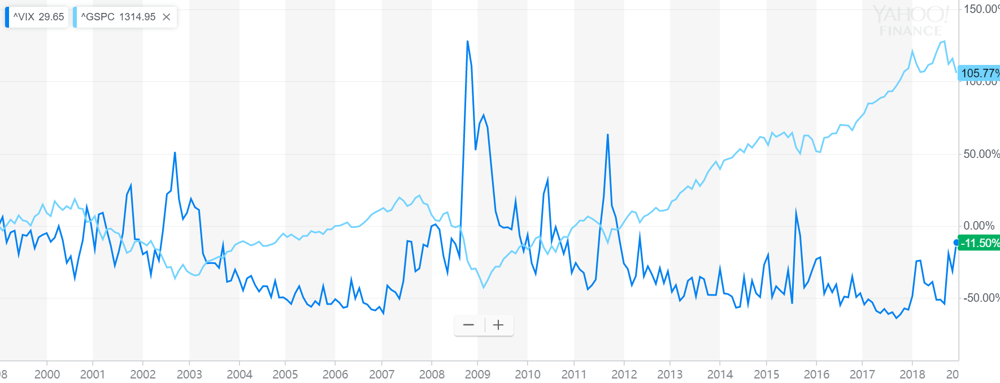

#Topic Introduction
Nowadays, volatility is widely used as a prime perimeter for financial risk management. Risk parity funds tend to hedge their exposure using derivatives when the market volatility exceeds some certain levels. The traditional GARCH model for volatility forecasting implies that Volatility will risk after a large movement in markets regardless of the direction of the movement. However, market experiences show that VIX index, which is calculated using the IV of index option, tend to rise when market crushes, and decrease when market rises. This phenomenon could be explained by the leverage effect, and our goal is to add the leverage effect to the traditional model and test whether our model is more accurate in forecasting the real volatility of the market for the period than the traditional GARCH model and the VIX index. 

```{r pressure, echo=FALSE, fig.cap="Source: Yahoo Finance", out.width = '100%'}

```

```{r, echo=FALSE, message=FALSE}
#Packages needed
library(forecast)
library(zoo)
library(plyr)
library(urca)
library(rugarch)
```

#Data Description
&&&1 First, we use the daily open and close quote for S&P500 ETF from yahoo finance to generate the SP500 return time series. The plot of data is as follows. From the graph, we can see there is no obvious trend or seasonality. 

Second, we use the daily realized volatility SP500 data from Oxford-Man institute of quantitative Finance library to get the realized volatility of SP500 from 2000.

Finally, we use the daily open and close data of VIX index from yahoo finance to get the market implied volatility of the SP500 index. ?

```{r, echo=FALSE}
#Load Data
SP500.raw <- read.csv("../data/S&P500.csv")
VIX.raw <- read.csv("../data/Vix.csv")
ReVol.raw <- read.csv("../data/RealizedVol.csv")
```

```{r, echo=FALSE}
#Relized Volatility time series
ReVol.df <- ReVol.raw[-(1:2),1:2]
colnames(ReVol.df) <- c("Date", "Vol")
ReVol.df$Date <- as.Date(ReVol.df$Date, format = "%Y%m%d")
ReVol.df$Vol <- sqrt(as.numeric(as.character(ReVol.df$Vol)))
ReVol.df<- ReVol.df[!is.na(ReVol.df$Vol),]
ReVol.ts <- zoo(ReVol.df$Vol, ReVol.df$Date)

#SP500 Close Price time series
dates.sp <- as.Date(SP500.raw$Date,format="%Y-%m-%d")
SP500.ts <- zoo(SP500.raw$Adj.Close,dates.sp)

# SP500 Return time series
SPret.ts <- diff(log(SP500.ts))

# Vix Index time series
dates.vix <- as.Date(VIX.raw$Date,format="%Y-%m-%d")
VIX.ts <- zoo(VIX.raw$Adj.Close,dates.vix)

# Align all Time Series 
startdate <- time(ReVol.ts)[1]
SPret.ts <- window(SPret.ts, start = startdate)
VIX.ts <- window(VIX.ts, start = startdate)
```

#Relized Volatility Forecasting
###Basic check for Relized Vol series
&&&2 The seasonal and trend or stationary from its plot?
```{r, echo=FALSE, dpi=300, fig.width=10, fig.height=7}
plot(ReVol.ts, ylim = c(0,0.06), cex.lab = 1.5, cex.main = 2,
     main = "SP500 Daily Realized Volatility (5-min Sub-sampled)",
     xlab = "Years",
     ylab = "Realized Volatility (Standard Deviation)")
```

&&&3 Unit Root Test check stationary?
```{r, echo=FALSE}
#Unit Root Test
ReVol.ur <- ur.df(ReVol.ts, type = "none", selectlags="BIC")
ReVol.ur
print("Critical Value Table")
summary(ReVol.ur)@cval
```

&&&4 ACF and PACF ?
```{r, echo=FALSE, dpi=300, fig.width=10, fig.height=7}
#ACF
Acf(as.numeric(ReVol.ts), cex.lab = 1.5, cex.main = 2, 
    main = "Autocorrelation Plot of SP500 Realized Vol")
#Pacf
Pacf(as.numeric(ReVol.ts),  cex.lab = 1.5, cex.main = 2,
     main = "Partial Autocorrelation Plot of SP500 Realized Vol")
```
###Data Preprocessing
&&&5 some descripe of the process and train and validation ?
```{r, echo=FALSE}
ma6.ts <-  rollmean(ReVol.ts, k=6, align="right")
Sign <- sign(SPret.ts) >0
ret_sign <- Sign * SPret.ts

lagvol <- cbind(ReVol.ts,
                lag(ReVol.ts,-1,na.pad=TRUE),
                lag(ReVol.ts,-2,na.pad=TRUE), 
                lag((ma6.ts),-2,na.pad=TRUE),
                SPret.ts,
                Sign,
                ret_sign)
colnames(lagvol) <- c("vol", "volL1", "volL2", "ma6L2","Return", "Sign", "Return*Sign")

lagvol# <- lagvol[complete.cases(lagvol),]

# Data Partitioning
ReVol.tra <- window(lagvol, end = "2015-01-02")
ReVol.va <- window(lagvol, start = "2015-01-03")
```

#GRACH Model as Benchmark
&&&6 GARCH Model used here and its forecast result?
```{r}
# Specifications
spec <- ugarchspec(variance.model=list(garchOrder=c(1,1)),
                   mean.model=list(armaOrder=c(0,0)))
fittrain <- ugarchfit(spec = spec, data=ReVol.tra$Return)

#forecast
setfixed(spec) <- as.list(coef(fittrain))
ugarchfilter <- ugarchfilter(spec=spec,data=ReVol.va$Return)

# fitted volatility
volfcast.grach<- zoo(sigma(ugarchfilter))

print("Validation set Forecasting errors of GARCH Model")
accuracy(na.locf(as.ts(ReVol.va$vol)), na.locf(as.ts(volfcast.grach)))

#Vix
#a <- window(VIX.ts, start = "2015-01-05")
#a <- a/sqrt(252)/100
```

&&&7 Explain the fit, not very good outcome from GARCH Model
```{r, echo=FALSE, dpi=300, fig.width=10, fig.height=7}
plot(ReVol.va$vol, ylim = c(0,0.06), cex.lab = 1.5, cex.main = 2,
     main = "SP500 Realized Volatility vs Forecasted Vol from GARCH",
     xlab = "Years",
     ylab = "Volatility (Standard Deviation)")
lines(volfcast.grach, col="red")
```

### Benchmark Model For Relized Volatility
&&&8 Explain how the two benchmark works and a little explaination of realized vol ?
```{r, echo=FALSE}
#ARMA model
ReVol.arima <- auto.arima(zoo(ReVol.tra[,1], time(ReVol.tra)),d=0,ic="bic",seasonal=FALSE)
#Best Arima model is AR2
arima.ben <- lm(vol ~ volL1 + volL2,data=ReVol.tra)
# MIDAS model
midas.ben <- lm(vol ~ volL1 + ma6L2,data=ReVol.tra)


arima.ben.pre <- predict(arima.ben, ReVol.va)
arima.ben.res <- ReVol.va$vol- arima.ben.pre

midas.ben.pre <- predict(midas.ben, ReVol.va)
midas.ben.res  <- ReVol.va$vol- midas.ben.pre
```

```{r,echo=FALSE}
print("Validation set Forecasting errors of AR2 Model")
arima.ben.acc <- accuracy(arima.ben.pre, ReVol.va$vol)
arima.ben.acc
```

```{r,echo=FALSE}
print("Validation set Forecasting errors of MIDAS Model")
midas.ben.acc <- accuracy(midas.ben.pre, ReVol.va$vol)
midas.ben.acc 
```

```{r,echo=FALSE}
print("Diebold/Mariano AR2 versus MIDAS")
dm.test(na.locf(as.ts(arima.ben.res)), na.locf(as.ts(midas.ben.res)))
```

###Leverage Effect as Dummy
&&&9 Explain the result?
```{r, echo=FALSE}
midas.dummy <- lm(vol ~ volL1 + ma6L2 + Sign,data=ReVol.tra)
midas.dummy.pre <- predict(midas.dummy, ReVol.va)
midas.dummy.res <- ReVol.va$vol- midas.dummy.pre
```

```{r,echo=FALSE}
print("Validation set Forecasting errors of MIDAS Model with Dummy Leverage Effect")
midas.dummy.acc <- accuracy(midas.dummy.pre, ReVol.va$vol)
midas.dummy.acc
```

```{r,echo=FALSE}
print("Diebold/Mariano MIDAS Model with Dummy Leverage Effect versus MIDAS Benchmark")
dm.test(na.locf(as.ts(midas.dummy.res)), na.locf(as.ts(midas.ben.res)))
```

###Leaverage Effect as Return
&&&11 Explain the result?
```{r}
midas.return <- lm(vol ~ volL1 + ma6L2 + Return, data=ReVol.tra)
midas.return.pre <- predict(midas.return, ReVol.va)
midas.return.res <- ReVol.va$vol- midas.return.pre
```

```{r,echo=FALSE}
print("Validation set Forecasting errors of MIDAS Model with Return")
midas.return.acc <- accuracy(midas.return.pre, ReVol.va$vol)
midas.return.acc 
```

```{r,echo=FALSE}
print("Diebold/Mariano MIDAS Model with Return versus MIDAS with dummy leverage effect")
dm.test(na.locf(as.ts(midas.return.res)), na.locf(as.ts(midas.dummy.res)))
```

###Return and Dummy
&&&10 Explain the result?
```{r}
midas.ret_sign <- lm(vol ~ volL1 + ma6L2 + Return + `Return*Sign`, data=ReVol.tra)
midas.ret_sign.pre <- predict(midas.ret_sign, ReVol.va)
midas.ret_sign.res <- ReVol.va$vol- midas.ret_sign.pre
```

```{r,echo=FALSE}
print("Validation set Forecasting errors of MIDAS Model with Return and Dummy")
midas.ret_sign.acc <- accuracy(midas.ret_sign.pre, ReVol.va$vol)
midas.ret_sign.acc
```

```{r,echo=FALSE}
print("Diebold/Mariano MIDAS Model with Return and Dummy versus MIDAS with Return")
dm.test(na.locf(as.ts(midas.ret_sign.res)), na.locf(as.ts(midas.return.res)))
```

###Model Selection/Evaluation
&&&13 Explain which model is best, and look deep into the model, and some things to notice
```{r, echo=FALSE}
RMSE <- rep(NA,5)
RMSE[1] <- arima.ben.acc[2]
RMSE[2] <- midas.ben.acc[2]
RMSE[3] <- midas.dummy.acc[2]
RMSE[4] <- midas.return.acc[2]
RMSE[5] <- midas.ret_sign.acc[2]

data.frame(RMSE = RMSE, row.names = c("AR2 Benchmark",
                                      "MIDAS Benchmark",
                                      "Leverage Effect as Dummy  Model",
                                      "Leverage Effect as Return Model",
                                      "Leverage Effect with Return and Dummy  Model"))
```

&&&13 ?
```{r, echo=FALSE}
summary(midas.ret_sign)
```

#Applicaiton 
###Vix comparation
&&&12 Explaination of the strategies ? 
```{r, echo=FALSE, dpi=300, fig.width=10, fig.height=7}
vix.plot <- window(VIX.ts, start = "2015-01-05")/sqrt(252)/100

plot(ReVol.va$vol, ylim = c(0,0.06), cex.lab = 1.5, cex.main = 2,
     main = "SP500 Realized Volatility and Forecastings vs Vix Index ",
     xlab = "Years",
     ylab = "Volatility (Standard Deviation)")
lines(volfcast.grach, col="red")
lines(zoo(midas.ret_sign.pre, time(ReVol.va$vol)), col="blue")
lines(vix.plot, col = "green")
legend("topright", 
       legend=c("Realized Vol", "GARCH Forecast", 
                "MIDAS with leverage effect forecast","Vix" ),
       col=c("black", "red", "blue", "green"),lty=1:1, cex=1.5)
```


###Control Vol
```{r}
# Build valid sample volatility forecast
vol.fcast <- predict( volTrain.mod, lagvolValid)
# Adjust this to monthly value (daily -> monthly)
vol.fcast <- sqrt(252)*vol.fcast
# set for 10 percent annual standard deviation
target <- 0.2
# now portfolio weight vector
weight <- target/vol.fcast
# constant portfolio benchmark
mweight <- mean(weight)

# dynamic monthly portfolio (assuming 3 percent/year interest)
pret  <-  lagvolValid[,5]*weight  + 0.03/12.*(1-weight)
pretConstant <-  lagvolValid[,5]*mweight + 0.03/12 *(1-mweight)
pretEquity   <-  lagvolValid[,5]* 1

# Volatility for portfolios (adjust for days of the month)
pstd  <-  sqrt(lagvolValid[,6])*lagvolValid[,1]*weight
pstdConstant <-  sqrt(lagvolValid[,6])*lagvolValid[,1]*mweight
pstdEquity   <-  sqrt(lagvolValid[,6])*lagvolValid[,1]*1

# Convert to annual values (like target)
pstd         <- sqrt(12)*pstd
pstdConstant <- sqrt(12)*pstdConstant
pstdEquity   <- sqrt(12)*pstdEquity

# Look at the variability of returns around volatility targets
print("Standard deviations and sd(standard deviations)")
print(cbind(mean(pstd),sd(pstd)))
print(cbind(mean(pstdConstant),sd(pstdConstant)))
print(cbind(mean(pstdEquity),sd(pstdEquity)))
 
# General mean and return for returns (annualized)           
print("mean and standard deviations for returns (annualized)")            
print(cbind(12*mean(pret),sqrt(12)*sd(pret)))
print(cbind(12*mean(pretConstant),sqrt(12)*sd(pretConstant)))
print(cbind(12*mean(pretEquity),sqrt(12)*sd(pretEquity)))

# Sharpe ratios
print("Sharpe ratios (annualized)")
print( (12*mean(pret)-0.03)/( sqrt(12)*sd(pret)))
print( (12*mean(pretConstant)-0.03)/( sqrt(12)*sd(pretConstant)))       
print( (12*mean(pretEquity)-0.03)/( sqrt(12)*sd(pretEquity)))       

plot(pstd,ylim=c(0,0.8),xlab="year",ylab="annualized std")
lines(pstdEquity,col="red")
grid()
```

