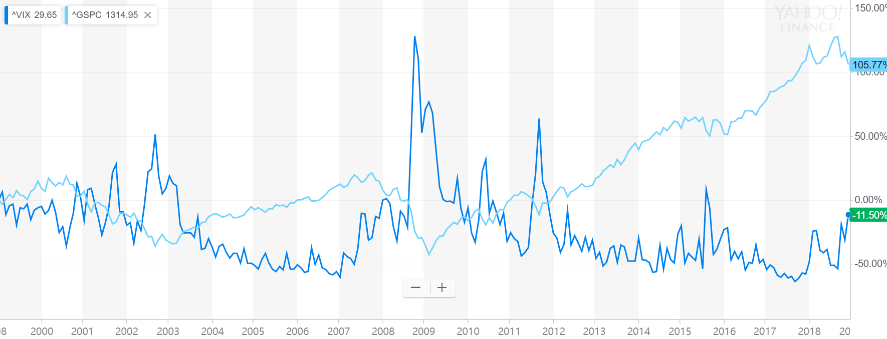

#Topic Introduction
Nowadays, volatility is widely used as a prime perimeter for financial risk management. Risk parity funds tend to hedge their exposure using derivatives when the market volatility exceeds some certain levels. The traditional GARCH model for volatility forecasting implies that Volatility will risk after a large movement in markets regardless of the direction of the movement. However, market experiences show that VIX index, which is calculated using the IV of index option, tend to rise when market crushes, and decrease when market rises. This phenomenon could be explained by the leverage effect, and our goal is to add the leverage effect to the traditional model and test whether our model is more accurate in forecasting the real volatility of the market for the period than the traditional GARCH model and the VIX index. 

```{r pressure, echo=FALSE, fig.cap="Source: Yahoo Finance", out.width = '100%'}

```

```{r, echo=FALSE, message=FALSE}
#Packages needed
library(forecast)
library(zoo)
library(plyr)
library(urca)
library(rugarch)
library(pander)
```

#Data Source
First, we use the daily open and close quote for S&P500 ETF from yahoo finance to generate the SP500 return time series. Second, we use the daily realized volatility SP500 data from Oxford-Man institute of quantitative Finance library to get the realized volatility of SP500 from 2000.Finally, we use the daily open and close data of VIX index from yahoo finance to get the market implied volatility of the SP500 index.

```{r, echo=FALSE}
#Load Data
SP500.raw <- read.csv("../data/S&P500.csv")
VIX.raw <- read.csv("../data/Vix.csv")
ReVol.raw <- read.csv("../data/RealizedVol.csv")
```

```{r, echo=FALSE}
#Relized Volatility time series
ReVol.df <- ReVol.raw[-(1:2),1:2]
colnames(ReVol.df) <- c("Date", "Vol")
ReVol.df$Date <- as.Date(ReVol.df$Date, format = "%Y%m%d")
ReVol.df$Vol <- sqrt(as.numeric(as.character(ReVol.df$Vol)))
ReVol.df<- ReVol.df[!is.na(ReVol.df$Vol),]
ReVol.ts <- zoo(ReVol.df$Vol, ReVol.df$Date)

#SP500 Close Price time series
dates.sp <- as.Date(SP500.raw$Date,format="%Y-%m-%d")
SP500.ts <- zoo(SP500.raw$Adj.Close,dates.sp)

# SP500 Return time series
SPret.ts <- diff(log(SP500.ts))

# Vix Index time series
dates.vix <- as.Date(VIX.raw$Date,format="%Y-%m-%d")
VIX.ts <- zoo(VIX.raw$Adj.Close,dates.vix)

# Align all Time Series 
startdate <- time(ReVol.ts)[1]
SPret.ts <- window(SPret.ts, start = startdate)
VIX.ts <- window(VIX.ts, start = startdate)
```

#Relized Volatility Forecasting
###Basic check for Realized Vol series

After getting the time series of realized volatility, SP500 returns and VIX, we want to investigate the properties of the data for our model selection. First, we plot the SP500 Daily Realized Volatility from 2000 to 2018 to get a full view. In the plot, we can find there are several peaks but the intervals between peaks are not constant. And the highest peak in 2008 could be demonstrated by Financial Crisis casuing market-wide panic. On the whole, we can conculde that the volatility has no seasonal pattern, and excluding the several extreme values, the volatility appears to be stationary. And the conclusion makes sense in real world because volatility is influenced by the market factors which have no seasonal pattern and market return also has long-run mean reversion which pulls the volatility to a certain level.

Since we assume the realized volatility is stationary, we use the type "one" unit root test, and we select the best model with lowest BIC. The t-test value is -7.9543, which is less than critical value for 1 percent significance level. Thus, we can conclude that on 99% confidence level, the realized volatility is stationary.

Then we use Acf and Pacf to find the autocorelation and partial autocorelation of the realized volatility. From Acf plot, we find the autocorelation decreases as the lag becomes larger, but even at lag 30, the atuocorelation is still larger than 0. From Pacf plot, only the first two pacf values are large and significant. And it seems that realized volatility can fit an AR(2) model. And we will dig into that later. 

```{r, echo=FALSE, dpi=300, fig.width=10, fig.height=7}
plot(ReVol.ts, ylim = c(0,0.06), cex.lab = 1.5, cex.main = 2,
     main = "SP500 Daily Realized Volatility (5-min Sub-sampled)",
     xlab = "Years",
     ylab = "Realized Volatility (Standard Deviation)")
```

```{r, echo=FALSE}
#Unit Root Test
ReVol.ur <- ur.df(ReVol.ts, type = "none", selectlags="BIC")
```

```{r, echo=FALSE, dpi=300, fig.width=10, fig.height=7}
#ACF
Acf(as.numeric(ReVol.ts), cex.lab = 1.5, cex.main = 2, 
    main = "Autocorrelation Plot of SP500 Realized Vol")
#Pacf
Pacf(as.numeric(ReVol.ts),  cex.lab = 1.5, cex.main = 2,
     main = "Partial Autocorrelation Plot of SP500 Realized Vol")
```

###Data Preprocessing
&&&5 some descripe of the process and train and validation ?
```{r, echo=FALSE}
ma6.ts <-  rollmean(ReVol.ts, k=6, align="right")
Sign <- sign(SPret.ts) >0
ret_sign <- Sign * SPret.ts

lagvol <- cbind(ReVol.ts,
                lag(ReVol.ts,-1,na.pad=TRUE),
                lag(ReVol.ts,-2,na.pad=TRUE), 
                lag(ma6.ts,-2,na.pad=TRUE),
                SPret.ts,
                lag(SPret.ts,-1,na.pad=TRUE),
                lag(Sign,-1,na.pad=TRUE),
                lag(ret_sign,-1,na.pad=TRUE))
colnames(lagvol) <- c("vol", "volL1", "volL2", "ma6L2","Return","ReturnL1", "SignL1", "Return*SignL1")

lagvol <- lagvol[complete.cases(lagvol),]

# Data Partitioning
ReVol.tra <- window(lagvol, end = "2015-01-02")
ReVol.va <- window(lagvol, start = "2015-01-03")
```

###GRACH Model as Benchmark

The chart below shows that GARCH model is not an accurate method to forecast SP500 volatility. During some periods when market goes up rapidly, the GARCH model???s forecast is even opposite to the real change in Volatility. 

```{r, echo=FALSE}
# Specifications
spec <- ugarchspec(variance.model=list(garchOrder=c(1,1)),
                   mean.model=list(armaOrder=c(0,0)))
fittrain <- ugarchfit(spec = spec, data=ReVol.tra$Return)

#forecast
setfixed(spec) <- as.list(coef(fittrain))
ugarchfilter <- ugarchfilter(spec=spec,data=ReVol.va$Return)

# fitted volatility
volfcast.grach<- zoo(sigma(ugarchfilter))

#Validation set Forecasting errors of GARCH Model
grach.acc <- accuracy(na.locf(as.ts(ReVol.va$vol)),
                      na.locf(as.ts(volfcast.grach)))

```

```{r, echo=FALSE, dpi=300, fig.width=10, fig.height=7}
plot(ReVol.va$vol, ylim = c(0,0.06), cex.lab = 1.5, cex.main = 2,
     main = "SP500 Realized Volatility vs Forecasted Vol from GARCH",
     xlab = "Years",
     ylab = "Volatility (Standard Deviation)")
lines(volfcast.grach, col="red")
```

### Benchmark Model For Relized Volatility
&&&8 Explain how the two benchmark works and a little explaination of realized vol ?
```{r, echo=FALSE}
#ARMA model
ReVol.arima <- auto.arima(zoo(ReVol.tra[,1], time(ReVol.tra)),d=0,ic="bic",seasonal=FALSE)
#Best Arima model is AR2
arima.ben <- lm(vol ~ volL1 + volL2,data=ReVol.tra)
# MIDAS model
midas.ben <- lm(vol ~ volL1 + ma6L2,data=ReVol.tra)


arima.ben.pre <- predict(arima.ben, ReVol.va)
arima.ben.res <- ReVol.va$vol- arima.ben.pre

midas.ben.pre <- predict(midas.ben, ReVol.va)
midas.ben.res  <- ReVol.va$vol- midas.ben.pre
```

```{r,echo=FALSE}
#Validation set Forecasting errors of AR2 Model
arima.ben.acc <- accuracy(arima.ben.pre, ReVol.va$vol)
```

```{r,echo=FALSE}
#Validation set Forecasting errors of MIDAS Model
midas.ben.acc <- accuracy(midas.ben.pre, ReVol.va$vol)
```

```{r,echo=FALSE}
#Diebold/Mariano AR2 versus MIDAS
dm1 <- dm.test(na.locf(as.ts(arima.ben.res)), na.locf(as.ts(midas.ben.res)))
```

###Leverage Effect as Dummy

For our first model, we add a dummy variable to the benchmark model to factor in the leverage effect. This method assumes that leverage effect from return is a constant effect and do not scales with return itself. 

The forecasting results give a slightly lower error in the validation set, but the volatility forecasting improvements are not proved statistically significant by Diebold/Mariano test against benchmark model without leaverage effect. The detailed outputs are shown in appendix.

```{r, echo=FALSE}
midas.dummy <- lm(vol ~ volL1 + ma6L2 + SignL1,data=ReVol.tra)
midas.dummy.pre <- predict(midas.dummy, ReVol.va)
midas.dummy.res <- ReVol.va$vol- midas.dummy.pre
```

```{r,echo=FALSE}
#Validation set Forecasting errors of MIDAS Model with Dummy Leverage Effect
midas.dummy.acc <- accuracy(midas.dummy.pre, ReVol.va$vol)
```

```{r,echo=FALSE}
#Diebold/Mariano MIDAS Model with Dummy Leverage Effect versus MIDAS Benchmark
dm2 <- dm.test(na.locf(as.ts(midas.dummy.res)), na.locf(as.ts(midas.ben.res)))
```

###Leverage Effect as Return

For our second model, we simply add the return factor to our benchmark model to mimic the leverage effect and test the accuracy of volatility forecasts in validation set. The forecasting results give a slight lower error in the validation set, but the volatility forecasting improvements are still not proved statistically significant by Diebold/Mariano test against benchmark. The detailed outputs are shown in appendix. 

The silightly better performance of this model against dummy variable model shows that the leaverage is not a constant effect but can scale with the level of the return, meaning that higher positive returns or lower negative returns all have a bigger leverage effect on future volatility.

```{r, echo=FALSE}
midas.return <- lm(vol ~ volL1 + ma6L2 + ReturnL1, data=ReVol.tra)
midas.return.pre <- predict(midas.return, ReVol.va)
midas.return.res <- ReVol.va$vol- midas.return.pre
```

```{r,echo=FALSE}
#Validation set Forecasting errors of MIDAS Model with Return
midas.return.acc <- accuracy(midas.return.pre, ReVol.va$vol)
```

```{r,echo=FALSE}
#Diebold/Mariano MIDAS Model with Return versus MIDAS Benchmark
dm3 <- dm.test(na.locf(as.ts(midas.return.res)), na.locf(as.ts(midas.ben.res)))
```

###Best Forecasting Model: Leverage effect as Return and Cross-product term with sign dummy

For our third model on the basis of second return model, we add the sign dummy multiply by the most recent return to reveal the asymmetric phenomenon in leverage effects, which is that Vol is more sensitive to leverage effect brought by negative returns and less to the effect brought by positive returns. According to the Diebold/Mariano test (Pvalue = 0.167), we are about 85% sure that leverage effects improves our Vol forecasting, and this model turns out to perform best in forecasting of S&P500 realized volatility based on the validation set error Table below.

```{r, echo=FALSE}
midas.ret_sign <- lm(vol ~ volL1 + ma6L2 + ReturnL1 +SignL1+ `Return*SignL1`, data=ReVol.tra)
midas.ret_sign.pre <- predict(midas.ret_sign, ReVol.va)
midas.ret_sign.res <- ReVol.va$vol- midas.ret_sign.pre
```

```{r,echo=FALSE}
#Validation set Forecasting errors of MIDAS Model with Return and Dummy
midas.ret_sign.acc <- accuracy(midas.ret_sign.pre, ReVol.va$vol)
```

```{r,echo=FALSE}
#Diebold/Mariano MIDAS Model with Return and Dummy versus MIDAS Benchmark
dm4 <- dm.test(na.locf(as.ts(midas.ret_sign.res)),
               na.locf(as.ts(midas.ben.res)))
```

**The forecasting error (MSE) from each Model**
```{r, echo=FALSE}
RMSE <- rep(NA,6)
RMSE[1] <- grach.acc[2]
RMSE[2] <- arima.ben.acc[2]
RMSE[3] <- midas.ben.acc[2]
RMSE[4] <- midas.dummy.acc[2]
RMSE[5] <- midas.return.acc[2]
RMSE[6] <- midas.ret_sign.acc[2]

pander(data.frame(RMSE = RMSE, 
           row.names = c("GARCH Model",
                         "AR2 Benchmark",
                         "MIDAS Benchmark",
                         "Leverage Effect as Dummy  Model",
                         "Leverage Effect as Return Model",
                         "Leverage Effect with Return and Dummy  Model")))
```

From the table, it is obvious that the forecasts improve as our models accouting for additional aspects and porperties of the leverage effect. Comparing to the orignial GARCH benchmark, our final best model offers some improvements at least in S&P500 series. 

The best model is a MIDAS model with leverage effect (return and Cross-product term with sign dummy):

$\sigma_t=0.0006409+0.3978\sigma_{t-1}+0.4890\sigma_{t-2}^{(6)}-0.1165Return_{t-1}+0.07443Return_{t-1}*Sign_{t-1}$

$\sigma_{t-2}^{(6)}=\frac{1}{6}\sum_{j=0}^{5}\sigma_{t-j-2}$

$\sigma_t$ is the realized volatility in time t (daily), $Sign_{t}$ is the indicator for return in t positive or negative (1 for positive and 0 for negative).

According to the formular, the leverage effect on negative return is $-0.1165Return_{t-1}$, and the leverage effect on positive return is $-0.04207Return_{t-1}$. Therefore, it proved the asymmetric phenomenon that a leverage effect (negative relationship between Vol and return) is more prominent in negative returns than in positive ones.

#Final Conclusion
```{r, echo=FALSE, dpi=300, fig.width=10, fig.height=7}
vix.plot <- window(VIX.ts, start = "2015-01-05")/sqrt(252)/100

plot(ReVol.va$vol, ylim = c(0,0.06), cex.lab = 1.5, cex.main = 2,
     main = "SP500 Realized Volatility and Forecastings vs Vix Index ",
     xlab = "Years",
     ylab = "Volatility (Standard Deviation)")
lines(volfcast.grach, col="red")
lines(zoo(midas.ret_sign.pre, time(ReVol.va$vol)), col="blue")
lines(vix.plot, col = "green")
legend("topright", 
       legend=c("Realized Vol", "GARCH Forecast", 
                "MIDAS with leverage effect forecast","Vix" ),
       col=c("black", "red", "blue", "green"),lty=1:1, cex=1.5)
```

As the chart shown above, we can see that VIX is not an accurate estimation of the real volatility of the S&P500 index, because the annualized VIX is generally 3-5% higher than the historical real realized volatility of S&P500 on the long run, indicating that investors are overpaying for index options. 

Moreover, the traditional GARCH model is a bad estimator for real volatility of the S&P500 index, because GARCH model ignores the leverage effects and in some strong bull market environments GARCH model's estimation on future volatility is totally contradict to the real change in S&P500 volatility.  

Finally, our MIDAS Model with leverage effect best fits the historical realized volatility of S&P500. Our model shows that volatility tend to rise after market crushes and volatility tend to drop in bull markets. We also find that future volatility is more sensitive to downward movements of the market and less sensitive to the upward movements in the market. We have two presumed explanations for these phenomena. Firstly, most large insurance companies using portfolio insurance strategy tend to sell some stock position or buying puts to deleverage their total exposure when the stock market falls, and their hedging actions would strengthen the market momentums and lead to higher volatility after market crushes. Secondly, behavior finance studies showed that most human beings tend to take profits after having some gain in portfolio. This risk aversion nature of investors makes the volatility of stock market drops when market goes up and less sensitive to the size of the upward movement.    

#Potential Financial Applications
###Option Volatility Trading Strategy Monitor

Our MIDAS Model with leverage effect could be used to build option trading strategy when our model's forecast Vol has a large dispersion with the VIX index. In rapidly crushing markets, the VIX index which is calculated using the implied volatility of 30 forward SP500 ETF options, is often temporarily over priced because some put sellers might be forced to unwind their position for margin call issues. If our model shows that the VIX is over-reacted we could enter the market to sell straddles to take advantage from the extraordinarily high implied volatility of options.   


